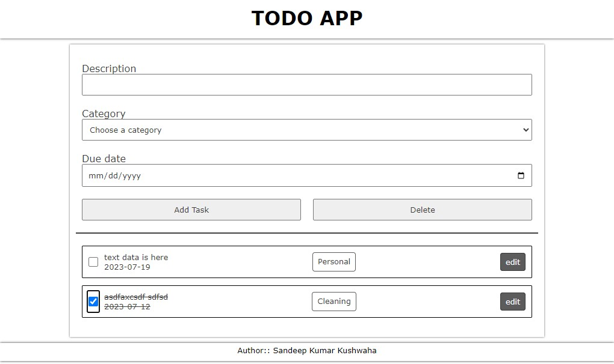
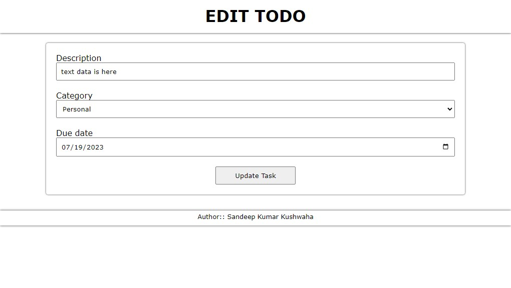

# Porject TODOApp

## Overview

It is a simple TODO application using NodeJS and MongDB. where a user of this application can create, edit and delete all the ToDo items.

Detailed Explaination of functionalities of TODOApp:

- 'Add' new todo.
- 'Select' your todo for select that shows mark as completed and then delete that todo's.
- 'Edit' your todo.
- 'Read All' the todo's on the home screen.

## Screenshot

## Project process

The TODOApp application is based on NodeJs and express as server side, MongoDb for database and ejs for front-end Technology.

## Built with

- HTML
- CSS
- JavaScript
- AJAX
- NodeJS
- express
- MongoDB
- ejs

## Useful resources

- [JavaScript](https://developer.mozilla.org/en-US/docs/Web/JavaScript)
- [expressJs](https://expressjs.com/)
- [MongoDb](https://mongoosejs.com/)

## Author

- LinkedIn - [Sandeep Kumar Kushwaha](https://www.linkedin.com/in/mrsandeepkushwaha/)
- Contact Email - [Sandeep Kumar Kushwaha](mailto:sandeepkush327@gmail.com)

## Acknowledgments

This project is done by ([SandeepKushwaha](https://github.com/SandeepKushwaha)) from scratch by refering to the above websites.
